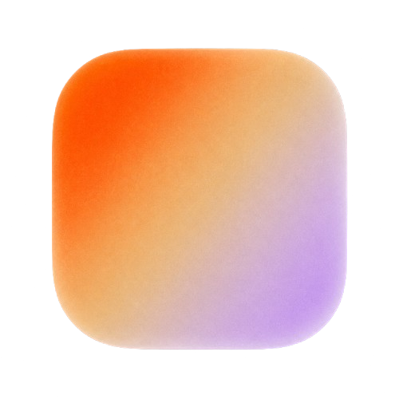

<div align="center">



# Haze

**Live wallpapers, a matching screensaver, and animated Metal gradients for macOS — native, lightweight, free.**

Liquid‑Glass UI · sips resources · open source

[](LICENSE)


</div>

---

**Haze** turns videos, GIFs, images, and animated **Metal gradients** into your **live
desktop wallpaper** and your **idle screensaver** — driven by one shared rendering
core, with aggressive power management so it stays out of the way and off your fans.

The hero feature is the **gradient engine**: silky 2D gradients and **Fluid 3D**
gradients (inspired by [shadergradient.co](https://shadergradient.co)) you can tune
live — palette, speed, blur, grain — or pick from dozens of bundled presets.

> [!NOTE]
> **What “while sleeping” really means.** When a Mac is *truly asleep* the display
> is off — there’s nothing to draw. Haze covers the two surfaces that actually
> exist: the **live wallpaper** (and the lock screen, which macOS derives from it)
> and the **screensaver** shown while the Mac is idle.

## Screenshots

> _Add a shot of the library and a gradient on the desktop here._
>
> `assets/library.png` · `assets/desktop.png`

## Features

- 🎞 **Live wallpapers** — looping video (H.264/HEVC, hardware‑decoded), animated GIFs, and stills.
- 🌈 **Gradient engine** — animated **Classic (2D)** and **Fluid (3D)** Metal gradients with an editable palette, speed, blur, and grain. Dozens of presets bundled.
- 💤 **Matching screensaver** — a real `.saver` plugin that reuses the same renderers, so your screensaver mirrors your live wallpaper automatically.
- 🖼 **Match macOS wallpaper** — optionally sets a still of your wallpaper as the system desktop picture, so Mission Control, the lock screen, and login match the live one.
- 🪶 **Lightweight by design** — pauses rendering when the desktop is fully covered, the display sleeps, the screen locks, or (optionally) on battery / Low Power Mode. Render resolution and frame rate are capped — ~0% CPU when occluded.
- 🧊 **Native Liquid Glass UI** — real Liquid Glass on macOS 26, graceful `.ultraThinMaterial` fallback on 15.
- ✨ **Menu‑bar agent** — no Dock clutter; switch wallpapers (grouped by category) or pause right from the menu bar.
- 🚀 **Launch at login** — optional, one toggle.

## Requirements

- macOS **15.0+** (built and tested on macOS 26, Apple Silicon)
- Xcode **26** with the **Metal Toolchain** component
- [XcodeGen](https://github.com/yonaskolb/XcodeGen) — `brew install xcodegen`

```bash
# one‑time, if the Metal toolchain isn't installed:
xcodebuild -downloadComponent MetalToolchain
```

## Build & run

```bash
make run          # generate the project, build, and launch
# or step by step:
make generate     # xcodegen → Haze.xcodeproj
make build        # debug build
make test         # run the HazeKit unit tests (56)
make release      # optimized build
```

Haze launches as a **menu‑bar** item (✨). Open the window from there, import media
or pick a gradient, and click any tile to set it as your live wallpaper.

## Installing the screensaver

In the app: **Screensaver → Install**, then **Open Screen Saver Settings** and
choose **HazeSaver**. macOS owns the idle timer, so set the start delay there. The
app bundles the `.saver` and copies it to `~/Library/Screen Savers/`. Leave the
screensaver on “Match wallpaper” and it follows whatever your live wallpaper is.

## How it works

```
HazeKit (framework)            shared by the app + the screensaver
├─ Model        ContentItem · GradientConfig · ShaderGradientConfig · AppSettings
├─ Library      LibraryManager (import, thumbnails, JSON manifest)
├─ Render       WallpaperRenderer → Video · AnimatedImage · Gradient · ShaderGradient · Static
│               (CappedMTKView caps the drawable so smooth gradients sip GPU)
├─ Gradient     Metal shaders (fBm + domain warp · 3D fluid mesh) · presets
├─ Display      WallpaperWindow (desktop level) · DisplayManager (per‑screen)
├─ Power        PlaybackPolicy (pure, unit‑tested) · PowerMonitor (sleep/lock/battery/occlusion)
└─ Shared       ContentStore · JSONStore · Logger

Haze (app)                     LSUIElement menu‑bar agent + SwiftUI Liquid‑Glass UI
HazeSaver (.saver)             ScreenSaverView reusing HazeKit renderers
```

State lives in `~/Library/Application Support/Haze/` (manifest · media · settings).
Both the app and the screensaver are non‑sandboxed and run as you, so no App Group
is needed — the screensaver just reads the same files.

**Resource discipline.** `PlaybackPolicy` is a pure function of environment +
preferences (fully unit‑tested). `PowerMonitor` feeds it from `NSWorkspace` sleep
notifications, screen‑lock notifications, IOKit power‑source changes, and occlusion
detection. When it says *don’t render*, every renderer pauses (video stops decoding,
`MTKView.isPaused = true`) — zero GPU/decode work.

## Roadmap

- [ ] Static **login‑window background** (admin‑only, OS‑restricted)
- [ ] **Per‑display** independent content
- [ ] GIF → HEVC transcode‑on‑import for lighter playback
- [ ] Notarized release + auto‑update

## Distribution notes

Haze is **non‑sandboxed** — desktop‑window placement and screensaver installation
are incompatible with the App Store sandbox, which also makes it **incompatible with
the Mac App Store** (and GPL‑3.0 is too). Local builds sign **ad‑hoc**; to share a
build, set a `DEVELOPMENT_TEAM`, keep Hardened Runtime on, and notarize.

## Contributing

Issues and PRs welcome. Keep changes focused, run `make test` before opening a PR,
and match the existing style (small focused files, value types, no force‑unwraps).

## License

[GPL‑3.0](LICENSE) © 2026 Haze contributors. Free and open source.
