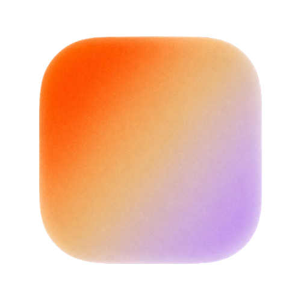
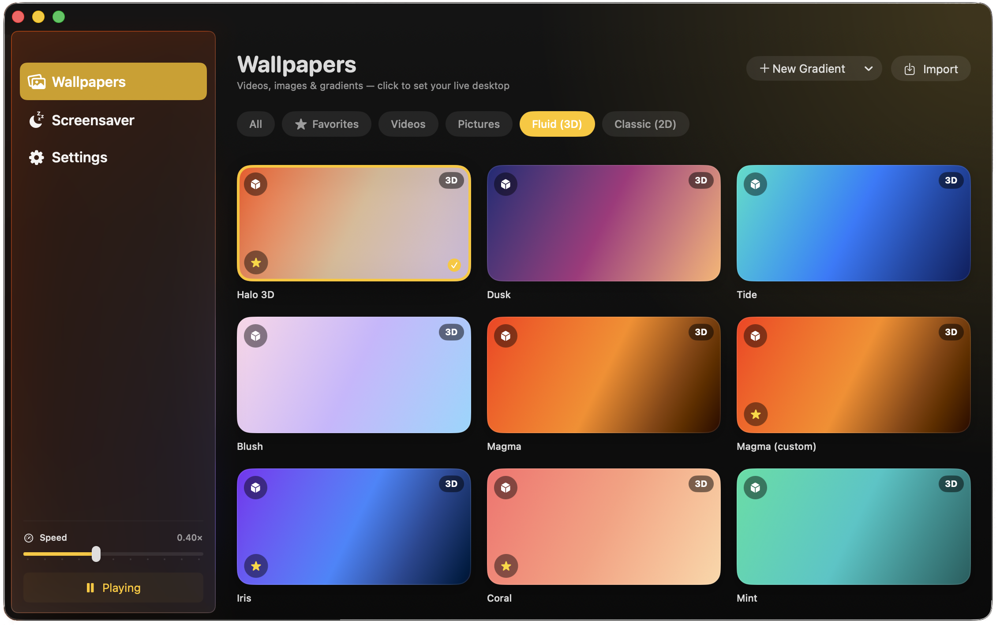
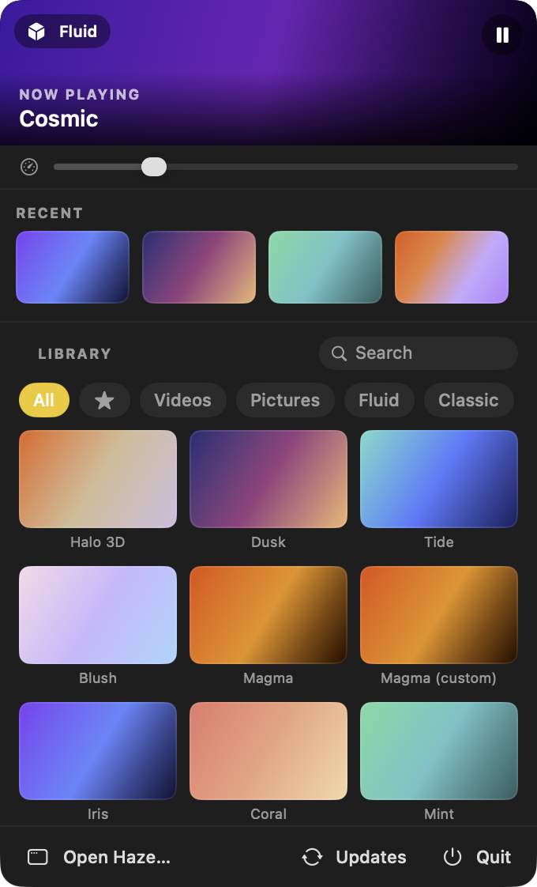

<div align="center">



# haze

**Live wallpapers, a matching screensaver, and animated Metal gradients for macOS — native, lightweight, free.**

Liquid‑Glass UI · sips resources · open source

[](LICENSE)


</div>

---

**Haze** turns videos, GIFs, images, and animated **Metal gradients** into your **live
desktop wallpaper** and your **idle screensaver** — driven by one shared rendering
core, with aggressive power management so it stays out of the way and off your fans.

The hero feature is the **gradient engine**: silky 2D gradients and **Fluid 3D**
gradients (inspired by [shadergradient.co](https://shadergradient.co)) you can tune
live — palette, speed, blur, grain — or pick from dozens of bundled presets.

> [!NOTE]
> **What “while sleeping” really means.** When a Mac is *truly asleep* the display
> is off — there’s nothing to draw. Haze covers the two surfaces that actually
> exist: the **live wallpaper** (and the lock screen, which macOS derives from it)
> and the **screensaver** shown while the Mac is idle.

## Screenshots

<div align="center">





</div>

## Features

- 🎞 **Live wallpapers** — looping video (H.264/HEVC, hardware‑decoded), animated GIFs, and stills.
- 🌈 **Gradient engine** — animated **Classic (2D)** and **Fluid (3D)** Metal gradients with an editable palette, speed, blur, and grain. Dozens of presets bundled.
- 💤 **Matching screensaver** — a real `.saver` plugin that reuses the same renderers, so your screensaver mirrors your live wallpaper automatically.
- 🖼 **Match macOS wallpaper** — optionally sets a still of your wallpaper as the system desktop picture, so Mission Control, the lock screen, and login match the live one.
- 🪶 **Lightweight by design** — pauses rendering when the desktop is fully covered, the display sleeps, the screen locks, or (optionally) on battery / Low Power Mode. Render resolution and frame rate are capped — ~0% CPU when occluded.
- 🧊 **Native Liquid Glass UI** — real Liquid Glass on macOS 26, graceful `.ultraThinMaterial` fallback on 15.
- ✨ **Menu‑bar picker** — no Dock clutter. A visual panel with what's playing pinned at the top, your recent wallpapers one click away, and the rest as a searchable, filterable thumbnail grid — plus pause and a speed slider.
- 🚀 **Launch at login** — optional, one toggle.
- 🔄 **In‑app auto‑updates** — checks daily (or on demand), shows the changelog, and installs in place (Sparkle, signed appcast).

## Download

Grab the latest **[`Haze.dmg`](https://github.com/adrbn/haze/releases/latest)** from
Releases, drag it to Applications, and launch.

> [!IMPORTANT]
> **An ad‑hoc signed copy cannot auto‑update — v0.1.0 included.** Sparkle refuses to
> install an update whose code signature doesn't match the installed app's, and an
> ad‑hoc binary's designated requirement *is its own cdhash*, which changes with
> every build. So the check can never pass, whatever the update is signed with.
> Verified on‑device: Sparkle logs `Code signature of the new version doesn't match
> the old version` and silently stops; the same update installs fine when both
> copies carry the same Developer ID. If you are on v0.1.0, download the DMG once by
> hand — from a Developer ID‑signed build onward, in‑app updates work.

Builds that are not signed with a Developer ID also trip Gatekeeper on first open:
open **System Settings → Privacy & Security → Open Anyway**, or run
`xattr -cr /Applications/Haze.app`.

## Requirements

- macOS **15.0+** (built and tested on macOS 26–27, Apple Silicon)
- Xcode **26** with the **Metal Toolchain** component
- [XcodeGen](https://github.com/yonaskolb/XcodeGen) — `brew install xcodegen`

```bash
# one‑time, if the Metal toolchain isn't installed:
xcodebuild -downloadComponent MetalToolchain
```

## Build & run

```bash
make run          # generate the project, build, and launch
# or step by step:
make generate     # xcodegen → Haze.xcodeproj
make build        # debug build
make test         # run the HazeKit unit tests (64)
make release      # optimized build
```

Haze launches as a **menu‑bar** item. Click the glyph for the wallpaper picker, or
open the full window from there to import media and edit gradients.

### Signed local installs

Builds are ad‑hoc signed by default, which needs no certificate — but the identity
changes on every build, so macOS re‑asks for any permission it had granted. With an
Apple **Developer ID** certificate in your keychain:

```bash
make install      # Developer ID-signed Release build → /Applications, relaunched
make notarize     # submit to Apple and staple the ticket
make verify-signature
```

`make notarize` needs a one-time `notarytool` keychain profile (it is never stored
in the repo). Create an App Store Connect API key under **Users and Access →
Integrations → Team Keys**, download the `.p8` (once only — it cannot be
re-downloaded), then:

```bash
xcrun notarytool store-credentials haze --key AuthKey_XXXX.p8 --key-id KEYID --issuer ISSUER-UUID
```

The identity is prefix-matched, so nothing personal lives in the repo; override it
with `make install SIGN_ID="Apple Development"`.

## Cutting a release

```bash
make release-publish TAG=v0.1.1
```

Builds a signed Release, notarizes and staples it, packages the DMG and the
Sparkle archive, generates the signed appcast, then tags and publishes the GitHub
release — asking for confirmation before anything becomes public. Every
precondition (clean tree, unused tag, certificate, notary profile, Sparkle key) is
checked up front, so a failure never leaves a half-published release.

The one-time setup is the notary profile above. Nothing else: the certificate is
already in your keychain.

<details>
<summary>Releasing from CI instead</summary>

`.github/workflows/release.yml` does the same on a tag push, but a runner has no
keychain — which is the only reason it needs the certificate exported as a `.p12`,
base64-encoded, and split across repo secrets (`MACOS_CERTIFICATE`,
`MACOS_CERTIFICATE_PWD`, `MACOS_SIGN_IDENTITY`, `APPLE_TEAM_ID`, `NOTARY_KEY`,
`NOTARY_KEY_ID`, `NOTARY_ISSUER_ID`, plus `SPARKLE_ED_PRIVATE_KEY`). Without all
of them it falls back to an ad-hoc build — which cannot auto-update, so prefer the
local path unless you need releases without your Mac.
</details>

## Installing the screensaver

In the app: **Screensaver → Install**, then **Open Screen Saver Settings** and
choose **HazeSaver**. macOS owns the idle timer, so set the start delay there. The
app bundles the `.saver` and copies it to `~/Library/Screen Savers/`. Leave the
screensaver on “Match wallpaper” and it follows whatever your live wallpaper is.

## How it works

```
HazeKit (framework)            shared by the app + the screensaver
├─ Model        ContentItem · GradientConfig · ShaderGradientConfig · AppSettings
├─ Library      LibraryManager (import, thumbnails, JSON manifest)
├─ Render       WallpaperRenderer → Video · AnimatedImage · Gradient · ShaderGradient · Static
│               (CappedMTKView caps the drawable so smooth gradients sip GPU)
├─ Gradient     Metal shaders (fBm + domain warp · 3D fluid mesh) · presets
├─ Display      WallpaperWindow (desktop level) · DisplayManager (per‑screen)
├─ Power        PlaybackPolicy (pure, unit‑tested) · PowerMonitor (sleep/lock/battery/occlusion)
└─ Shared       ContentStore · JSONStore · Logger

Haze (app)                     LSUIElement menu‑bar agent + SwiftUI Liquid‑Glass UI
HazeSaver (.saver)             ScreenSaverView reusing HazeKit renderers
```

State lives in `~/Library/Application Support/Haze/` (manifest · media · settings).
Both the app and the screensaver are non‑sandboxed and run as you, so no App Group
is needed — the screensaver just reads the same files.

**Resource discipline.** `PlaybackPolicy` is a pure function of environment +
preferences (fully unit‑tested). `PowerMonitor` feeds it from `NSWorkspace` sleep
notifications, screen‑lock notifications, IOKit power‑source changes, and occlusion
detection. When it says *don’t render*, every renderer pauses (video stops decoding,
`MTKView.isPaused = true`) — zero GPU/decode work.

## Roadmap

- [ ] Static **login‑window background** (admin‑only, OS‑restricted)
- [ ] **Per‑display** independent content
- [ ] GIF → HEVC transcode‑on‑import for lighter playback
- [x] In‑app auto‑update (Sparkle) with signed appcast
- [x] Developer ID signing + notarization pipeline (`make notarize`, opt-in CI secrets)

## Distribution notes

Haze is **non‑sandboxed** — desktop‑window placement and screensaver installation
are incompatible with the App Store sandbox, which also makes it **incompatible with
the Mac App Store** (and GPL‑3.0 is too).

Signing is opt‑in everywhere, so the project builds with no certificate at all.
Set `HAZE_CODE_SIGN_IDENTITY` / `HAZE_DEVELOPMENT_TEAM` (as `make install` does) to
sign with a Developer ID; the release workflow does the same, plus notarization and
stapling, once its signing secrets are set — and falls back to the ad‑hoc build
until then. Hardened Runtime is always on.

**Releases must be Developer ID‑signed.** Not for Gatekeeper — for Sparkle: an
ad‑hoc signed copy can never install an update (see Download above), so an ad‑hoc
release strands everyone who installs it.

## Contributing

Issues and PRs welcome. Keep changes focused, run `make test` before opening a PR,
and match the existing style (small focused files, value types, no force‑unwraps).

## License

[GPL‑3.0](LICENSE) © 2026 Haze contributors. Free and open source.
