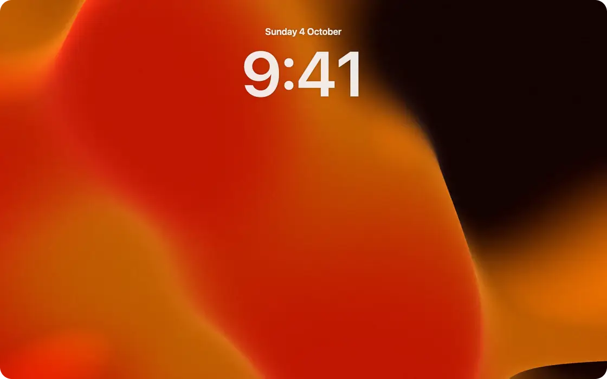
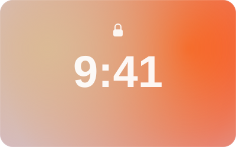

<div align="center">

# Haze

**Live wallpapers, a matching screensaver, and animated Metal gradients for macOS.**<br>
Native, light on your Mac, free and open source.

<br>



<br>

<a href="https://github.com/adrbn/haze/releases/latest"></a>&nbsp;
<a href="#presets"></a>&nbsp;
<a href="#build--run"></a>&nbsp;
<a href="#how-it-works"></a>

<br>

[](#requirements)
[](#requirements)
[](#how-it-works)
[](#download)
[](https://github.com/adrbn/haze/releases/latest)
[](LICENSE)

</div>

---

**Haze** turns videos, GIFs, images, and animated **Metal gradients** into your **live
desktop wallpaper** and your **idle screensaver** — driven by one shared rendering
core, with aggressive power management so it stays out of the way and off your fans.

The hero feature is the **gradient engine**: silky 2D gradients and **Fluid 3D**
gradients (inspired by [shadergradient.co](https://shadergradient.co)) you can tune
live — palette, speed, blur, grain — or pick from the 27 bundled [presets](#presets).

> [!NOTE]
> **What “while sleeping” really means.** When a Mac is *truly asleep* the display
> is off — there’s nothing to draw. Haze covers the two surfaces that actually
> exist: the **live wallpaper** (and the lock screen, which macOS derives from it)
> and the **screensaver** shown while the Mac is idle.

## Features

<table>
  <tr>
    <td align="center" valign="top" width="33%"><br><b>Live wallpapers</b><br><sub>Looping video (H.264 and HEVC, hardware‑decoded), animated GIFs, stills and gradients, on the desktop behind your windows.</sub></td>
    <td align="center" valign="top" width="33%"><br><b>Gradient engine</b><br><sub>Animated Classic (2D) and Fluid (3D) Metal gradients. Change the palette, speed, blur and grain live, or start from a preset.</sub></td>
    <td align="center" valign="top" width="33%"><br><b>A matching screensaver</b><br><sub>A real <code>.saver</code> plugin on the same renderers. Leave it on “Match wallpaper” and it follows your live wallpaper.</sub></td>
  </tr>
  <tr>
    <td align="center" valign="top"><br><b>Light by design</b><br><sub>Pauses when the desktop is fully covered, the display sleeps, the screen locks, or (optionally) on battery and Low Power Mode. Resolution and frame rate are capped: ~0% CPU when covered.</sub></td>
    <td align="center" valign="top"><br><b>Menu‑bar picker</b><br><sub>No Dock icon. What’s playing pinned at the top, recent wallpapers one click away, the rest in a searchable, filterable grid, with pause and a speed slider.</sub></td>
    <td align="center" valign="top"><br><b>Matches macOS</b><br><sub>Optionally sets a still of your wallpaper as the system desktop picture, so Mission Control, the lock screen and login match the live one.</sub></td>
  </tr>
</table>

And around it:

- **Native Liquid Glass UI** — real Liquid Glass on macOS 26, graceful `.ultraThinMaterial` fallback on 15.
- **Launch at login** — optional, one toggle.
- **In‑app auto‑updates** — checks daily (or on demand), shows the changelog, and installs in place (Sparkle, signed appcast).
- **Signed and notarized** — Developer ID, hardened runtime, Apple‑notarized with the ticket stapled, so it opens on a double‑click.

## Presets

<div align="center">

</div>

Every preset that ships in the app, 19 Fluid 3D and 8 Classic 2D, in its real colours: the swatches
are drawn from `Sources/HazeKit/Gradient/*Presets.swift` by [`assets/make_svgs.py`](assets/make_svgs.py),
so they follow the code. In the app each one is a live Metal gradient you can tune.

## Download

Grab the latest **[`Haze.dmg`](https://github.com/adrbn/haze/releases/latest)** from
Releases, drag it to Applications, and launch. From **v0.1.4** the app is signed
with a Developer ID and notarized by Apple, with the ticket stapled — it opens on a
double‑click, with no Gatekeeper warning and no `xattr` incantation, and it keeps
itself up to date from there.

> [!IMPORTANT]
> **Already running v0.1.3 or earlier? Update by hand, once.** Those builds were
> ad‑hoc signed, and an ad‑hoc copy can never auto‑update — so they will sit on
> their version forever, silently, without ever telling you an update exists.
> Download the DMG above and replace the app; every update after that is automatic.
>
> Why: Sparkle refuses an update whose code signature doesn't match the installed
> app's, and an ad‑hoc binary's designated requirement *is its own cdhash*, which
> changes with every build — so the check can never pass, whatever the update is
> signed with. Verified on‑device across three runs: ad‑hoc → Developer ID fails,
> ad‑hoc → ad‑hoc fails (which rules out the certificate change as the cause), and
> Developer ID → Developer ID installs and relaunches cleanly. Sparkle logs
> `Code signature of the new version doesn't match the old version` and stops.

A build you compile yourself is ad‑hoc signed unless you pass a Developer ID (see
[Signed local installs](#signed-local-installs)), so it will trip Gatekeeper on
first open: **System Settings → Privacy & Security → Open Anyway**, or
`xattr -cr /Applications/Haze.app`.

## Requirements

- macOS **15.0+** (built and tested on macOS 26–27, Apple Silicon)
- Xcode **26** with the **Metal Toolchain** component
- [XcodeGen](https://github.com/yonaskolb/XcodeGen) — `brew install xcodegen`

```bash
# one‑time, if the Metal toolchain isn't installed:
xcodebuild -downloadComponent MetalToolchain
```

## Build & run

```bash
make run          # generate the project, build, and launch
# or step by step:
make generate     # xcodegen → Haze.xcodeproj
make build        # debug build
make test         # run the HazeKit unit tests (64)
make release      # optimized build
```

Haze launches as a **menu‑bar** item. Click the glyph for the wallpaper picker, or
open the full window from there to import media and edit gradients.

### Signed local installs

Builds are ad‑hoc signed by default, which needs no certificate — but the identity
changes on every build, so macOS re‑asks for any permission it had granted. With an
Apple **Developer ID** certificate in your keychain:

```bash
make install      # Developer ID-signed Release build → /Applications, relaunched
make notarize     # submit to Apple and staple the ticket
make verify-signature
```

`make notarize` needs a one-time `notarytool` keychain profile (it is never stored
in the repo). Create an App Store Connect API key under **Users and Access →
Integrations → Team Keys**, download the `.p8` (once only — it cannot be
re-downloaded), then:

```bash
xcrun notarytool store-credentials haze --key AuthKey_XXXX.p8 --key-id KEYID --issuer ISSUER-UUID
```

The identity is prefix-matched, so nothing personal lives in the repo; override it
with `make install SIGN_ID="Apple Development"`.

## Cutting a release

```bash
make release-publish TAG=v0.1.4
```

Builds a signed Release, notarizes and staples it, packages the DMG and the
Sparkle archive, generates the signed appcast, then tags and publishes the GitHub
release — asking for confirmation before anything becomes public. Every
precondition (clean tree, unused tag, certificate, notary profile, Sparkle key) is
checked up front, so a failure never leaves a half-published release.

The one-time setup is the notary profile above. Nothing else: the certificate is
already in your keychain.

<details>
<summary>Releasing from CI instead</summary>

`.github/workflows/release.yml` does the same on a tag push, but a runner has no
keychain — which is the only reason it needs the certificate exported as a `.p12`,
base64-encoded, and split across repo secrets (`MACOS_CERTIFICATE`,
`MACOS_CERTIFICATE_PWD`, `MACOS_SIGN_IDENTITY`, `APPLE_TEAM_ID`, `NOTARY_KEY`,
`NOTARY_KEY_ID`, `NOTARY_ISSUER_ID`, plus `SPARKLE_ED_PRIVATE_KEY`). Without all
of them it falls back to an ad-hoc build — which cannot auto-update, so prefer the
local path unless you need releases without your Mac.
</details>

## Installing the screensaver

In the app: **Screensaver → Install**, then **Open Screen Saver Settings** and
choose **HazeSaver**. macOS owns the idle timer, so set the start delay there. The
app bundles the `.saver` and copies it to `~/Library/Screen Savers/`. Leave the
screensaver on “Match wallpaper” and it follows whatever your live wallpaper is.

## How it works

```
HazeKit (framework)            shared by the app + the screensaver
├─ Model        ContentItem · GradientConfig · ShaderGradientConfig · AppSettings
├─ Library      LibraryManager (import, thumbnails, JSON manifest)
├─ Render       WallpaperRenderer → Video · AnimatedImage · Gradient · ShaderGradient · Static
│               (CappedMTKView caps the drawable so smooth gradients sip GPU)
├─ Gradient     Metal shaders (fBm + domain warp · 3D fluid mesh) · presets
├─ Display      WallpaperWindow (desktop level) · DisplayManager (per‑screen)
├─ Power        PlaybackPolicy (pure, unit‑tested) · PowerMonitor (sleep/lock/battery/occlusion)
└─ Shared       ContentStore · JSONStore · Logger

Haze (app)                     LSUIElement menu‑bar agent + SwiftUI Liquid‑Glass UI
HazeSaver (.saver)             ScreenSaverView reusing HazeKit renderers
```

State lives in `~/Library/Application Support/Haze/` (manifest · media · settings).
Both the app and the screensaver are non‑sandboxed and run as you, so no App Group
is needed — the screensaver just reads the same files.

**Resource discipline.** `PlaybackPolicy` is a pure function of environment +
preferences (fully unit‑tested). `PowerMonitor` feeds it from `NSWorkspace` sleep
notifications, screen‑lock notifications, IOKit power‑source changes, and occlusion
detection. When it says *don’t render*, every renderer pauses (video stops decoding,
`MTKView.isPaused = true`) — zero GPU/decode work.

## Roadmap

- [ ] Static **login‑window background** (admin‑only, OS‑restricted)
- [ ] **Per‑display** independent content
- [ ] GIF → HEVC transcode‑on‑import for lighter playback
- [x] In‑app auto‑update (Sparkle) with signed appcast
- [x] Developer ID signing, notarization and stapling — shipped in v0.1.4, one command (`make release-publish`)

## Distribution notes

Haze is **non‑sandboxed** — desktop‑window placement and screensaver installation
are incompatible with the App Store sandbox, which also makes it **incompatible with
the Mac App Store** (and GPL‑3.0 is too).

Signing is opt‑in everywhere, so the project builds with no certificate at all.
Set `HAZE_CODE_SIGN_IDENTITY` / `HAZE_DEVELOPMENT_TEAM` (as `make install` does) to
sign with a Developer ID; the release workflow does the same, plus notarization and
stapling, once its signing secrets are set — and falls back to the ad‑hoc build
until then. Hardened Runtime is always on.

**Releases must be Developer ID‑signed.** Not for Gatekeeper — for Sparkle: an
ad‑hoc signed copy can never install an update (see Download above), so an ad‑hoc
release strands everyone who installs it.

## Contributing

Issues and PRs welcome. Keep changes focused, run `make test` before opening a PR,
and match the existing style (small focused files, value types, no force‑unwraps).

## License

[GPL‑3.0](LICENSE) © 2026 Haze contributors. Free and open source.
